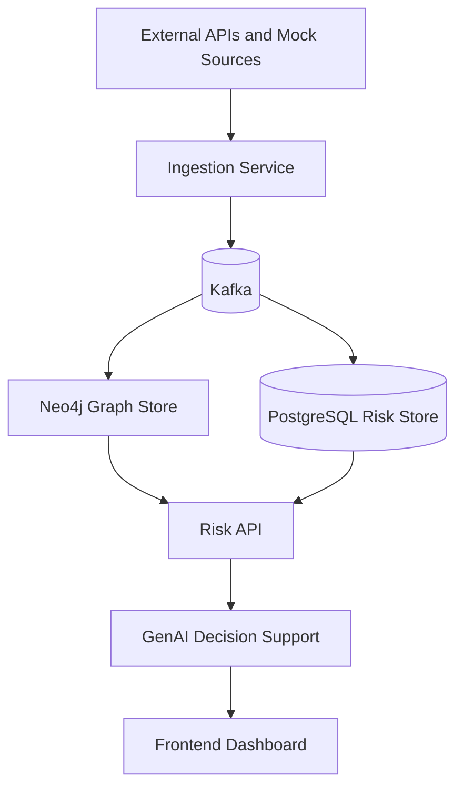

# supplyChainNexus

Intelligent Global Supply Chain Risk Management platform.

## What This Repository Contains

This repo is structured as a modular, event-driven platform:

- Mock and external data sources generate canonical supply-chain events.
- The ingestion layer validates and publishes those events to Kafka.
- Graph and risk services materialize relationship and risk views.
- GenAI services turn risk context into explanations and recommendations.
- The frontend consumes the risk API only and never talks to the data stores directly.

## Repository Structure

- `services/ingestion` - event validation, normalization, and Kafka publishing.
- `services/graph` - Neo4j materialization and relationship queries.
- `services/risk_api` - read APIs for risk insights, alerts, and decision support.
- `services/genai` - GenAI orchestration and narrative generation.
- `mocks/iot_sensor` - synthetic IoT telemetry fixtures.
- `mocks/supplier_erp` - synthetic supplier ERP fixtures.
- `supplier-erp-mock` - runnable FastAPI mock that emits the canonical supplier event envelope.
- `frontend` - dashboard shell and user-facing views.
- `docs` - architecture, boundaries, and schema contracts.

## Service Boundaries

The platform is intentionally separated so each service owns one responsibility:

- Ingestion owns event hygiene and Kafka publication.
- Graph owns entity relationships and topology queries.
- Risk API owns read models and user-facing endpoints.
- GenAI owns recommendations, explanations, and assistant-style responses.
- Frontend owns presentation only.

## Canonical Event Contract

All services exchange a shared event envelope documented in [docs/architecture/canonical-event-schema.md](docs/architecture/canonical-event-schema.md) and implemented in the supplier mock.

## Local Development

1. Copy `.env.example` to `.env`.
2. Start infrastructure with Docker Compose.
3. Run the service you are working on inside its own folder.

## Team

- Vishnu Vardhan Reddy
- Raghav
- Vicky

## Tech Stack

- Python
- FastAPI
- Neo4j
- Kafka
- React
- PostgreSQL
- Docker
- Azure OpenAI

## High-Level Flow

