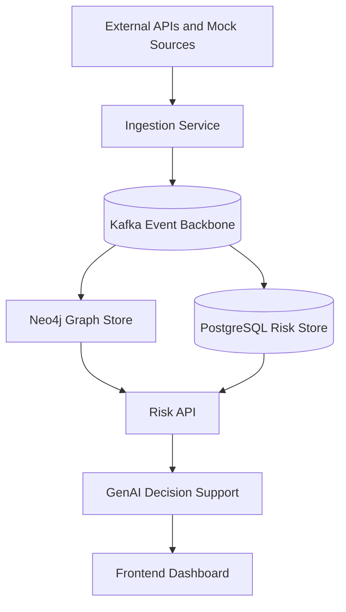

# Architecture Overview

The platform is organized as an event-driven supply-chain intelligence system.

## Core Design Principles

- Canonical events are the only contract between producers and consumers.
- Ingestion normalizes data, but it does not own business decisions.
- Graph and risk services are separate so graph traversal and risk scoring can evolve independently.
- GenAI augments decisions; it does not replace deterministic risk logic.
- The frontend consumes read-only APIs.

## Data Stores

- Kafka carries normalized events.
- Neo4j stores entities and relationships.
- PostgreSQL stores materialized risk state, alerts, and operational read models.

## Development Rule

Any new service must declare whether it is a producer, consumer, or read-model owner before implementation starts.